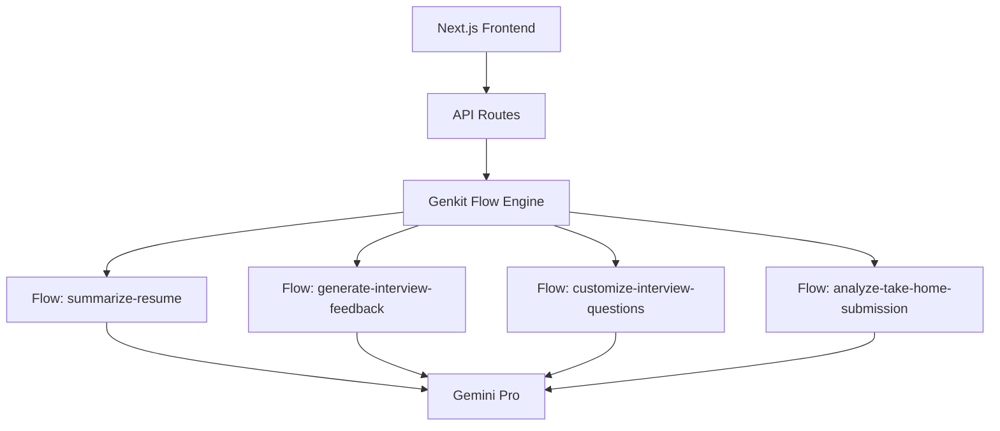
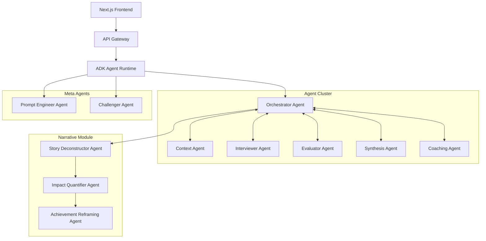

# Migration Strategy: Genkit to Google Agent Development Kit

**Version:** 1.0  
**Date:** June 2025  
**Status:** Draft

## Executive Summary

This document outlines the strategic migration from Google Genkit to Google's Agent Development Kit (ADK) for the AI Interview Coach multi-agent system. The migration will enable sophisticated agent orchestration, improved state management, and better support for the adaptive reasoning requirements outlined in the prompt engineering roadmap.

## Migration Rationale

### Current Genkit Limitations
1. **Flow-centric design** - Built for individual AI flows, not multi-agent orchestration
2. **Limited state management** - No native support for complex state machines
3. **No agent abstraction** - Requires custom implementation for agent boundaries
4. **Orchestration complexity** - Manual coordination between flows
5. **Monitoring gaps** - Limited visibility into agent interactions

### ADK Advantages
1. **Native multi-agent support** - Built-in agent coordination and communication
2. **Sophisticated state management** - Support for complex state machines and persistence
3. **Agent lifecycle management** - Automatic agent spawning, monitoring, and termination
4. **Built-in observability** - Comprehensive tracing and metrics for agent interactions
5. **Adaptive reasoning support** - Dynamic routing and complexity assessment

## Migration Architecture

### Current Genkit Architecture



### Target ADK Architecture



## Migration Phases

### Phase 1: Foundation Setup (Weeks 1-2)

#### Objectives
- Set up ADK development environment
- Create proof-of-concept Orchestrator Agent
- Validate agent communication patterns

#### Tasks

**Week 1: Environment Setup**
```typescript
// 1. Install ADK SDK
npm install @google-cloud/agent-development-kit

// 2. Initialize ADK project structure
adk init interview-ai-agents
cd interview-ai-agents

// 3. Configure agent runtime
// File: adk.config.ts
export const adkConfig = {
  runtime: {
    platform: 'cloud-functions',
    region: 'us-central1',
    memory: '1Gi',
    timeout: '60s'
  },
  
  agents: {
    orchestrator: {
      type: 'StatefulAgent',
      maxInstances: 10,
      concurrency: 5
    }
  },
  
  communication: {
    protocol: 'grpc',
    encryption: 'tls',
    authentication: 'service-account'
  }
};
```

**Week 2: Orchestrator Agent POC**
```typescript
// File: agents/orchestrator/orchestrator.agent.ts
import { Agent, StateMachine, AgentContext } from '@google-cloud/adk';

@Agent({
  name: 'orchestrator',
  version: '1.0.0',
  description: 'Central coordinator for interview sessions'
})
export class OrchestratorAgent {
  private stateMachine: StateMachine;
  
  constructor() {
    this.stateMachine = new StateMachine({
      initialState: 'configuring',
      states: {
        configuring: { transitions: ['scoping'] },
        scoping: { transitions: ['analysis', 'challenging'] },
        analysis: { transitions: ['solutioning', 'challenging'] },
        solutioning: { transitions: ['metrics', 'challenging'] },
        metrics: { transitions: ['challenging'] },
        challenging: { transitions: ['report_generation'] },
        report_generation: { transitions: ['end'] },
        end: { transitions: [] }
      }
    });
  }
  
  @MessageHandler('user.start_interview')
  async startInterview(context: AgentContext, message: StartInterviewMessage) {
    // Initialize session state
    const sessionState = await this.initializeSession(message.userId, message.resume);
    
    // Transition to scoping phase
    await this.stateMachine.transition('scoping');
    
    // Send directive to Interviewer Agent
    await context.sendMessage('interviewer', {
      type: 'generate_scoping_question',
      sessionId: sessionState.id,
      context: sessionState.context
    });
  }
  
  @MessageHandler('evaluator.response_scored')
  async handleEvaluatorResponse(context: AgentContext, message: ScoringMessage) {
    // Check gating conditions
    const shouldIntervene = await this.checkGatingConditions(message.scores);
    
    if (shouldIntervene) {
      // Send intervention directive
      await context.sendMessage('interviewer', {
        type: 'intervention',
        directive: this.getInterventionDirective(message.scores)
      });
    } else {
      // Continue with normal flow
      await this.advancePhase(context);
    }
  }
  
  @StateTransition('scoping', 'analysis')
  async transitionToAnalysis(context: AgentContext) {
    // Assess complexity before transitioning
    const complexity = await this.assessComplexity(context.sessionState.lastResponse);
    
    // Route to appropriate Interviewer prompt variant
    await context.sendMessage('interviewer', {
      type: 'set_prompt_variant',
      complexity: complexity,
      phase: 'analysis'
    });
  }
}
```

#### Success Criteria
- ADK environment successfully configured
- Orchestrator Agent can receive messages and manage state
- Basic agent-to-agent communication working
- State transitions functioning correctly

### Phase 2: Core Agent Migration (Weeks 3-6)

#### Objectives
- Migrate Context, Interviewer, and Evaluator agents
- Implement adaptive reasoning logic
- Add complexity assessment capabilities

#### Week 3: Context Agent Migration
```typescript
@Agent({
  name: 'context',
  version: '1.0.0',
  capabilities: ['document_parsing', 'data_extraction']
})
export class ContextAgent {
  @MessageHandler('orchestrator.parse_resume')
  async parseResume(context: AgentContext, message: ParseResumeMessage) {
    try {
      // Parse document using existing logic
      const parsedData = await this.parseDocument(message.documentUrl);
      
      // Structure data for other agents
      const structuredContext = await this.structureData(parsedData);
      
      // Respond to orchestrator
      await context.sendMessage('orchestrator', {
        type: 'context_ready',
        sessionId: message.sessionId,
        context: structuredContext,
        status: 'success'
      });
      
    } catch (error) {
      // Implement fallback strategy
      await context.sendMessage('orchestrator', {
        type: 'context_error',
        sessionId: message.sessionId,
        error: error.message,
        fallback: await this.generateFallbackContext()
      });
    }
  }
}
```

#### Week 4: Interviewer Agent Migration
```typescript
@Agent({
  name: 'interviewer',
  version: '1.0.0',
  capabilities: ['question_generation', 'conversation_management']
})
export class InterviewerAgent {
  private promptRegistry: PromptRegistry;
  
  @MessageHandler('orchestrator.generate_question')
  async generateQuestion(context: AgentContext, message: QuestionRequest) {
    // Get appropriate prompt variant based on complexity
    const promptVariant = await this.selectPromptVariant(
      message.phase,
      message.complexity
    );
    
    try {
      // Generate question using selected variant
      const question = await this.generateWithPrompt(
        promptVariant,
        message.context
      );
      
      // Track metrics
      await this.recordMetrics({
        promptVariant: promptVariant.id,
        complexity: message.complexity,
        latency: Date.now() - startTime,
        tokensUsed: question.tokensUsed
      });
      
      await context.sendMessage('orchestrator', {
        type: 'question_generated',
        question: question.text,
        metadata: question.metadata
      });
      
    } catch (error) {
      // Implement fallback chain
      const fallbackQuestion = await this.getFallbackQuestion(message.phase);
      
      await context.sendMessage('orchestrator', {
        type: 'question_generated',
        question: fallbackQuestion,
        fallback: true,
        error: error.message
      });
    }
  }
  
  private async selectPromptVariant(
    phase: InterviewPhase,
    complexity: ComplexityLevel
  ): Promise<PromptVariant> {
    const variants = await this.promptRegistry.getVariants(
      'interviewer',
      phase,
      complexity
    );
    
    // Use A/B testing framework
    return await this.abTestFramework.selectVariant(variants);
  }
}
```

#### Week 5: Evaluator Agent Migration
```typescript
@Agent({
  name: 'evaluator',
  version: '1.0.0',
  capabilities: ['transcript_analysis', 'rubric_scoring']
})
export class EvaluatorAgent {
  @MessageHandler('orchestrator.evaluate_response')
  async evaluateResponse(context: AgentContext, message: EvaluationRequest) {
    // Select evaluation strategy based on complexity
    const strategy = this.selectEvaluationStrategy(message.complexity);
    
    const startTime = Date.now();
    
    try {
      // Perform evaluation
      const scores = await strategy.evaluate(
        message.transcript,
        message.rubrics
      );
      
      // Extract evidence
      const evidence = await this.extractEvidence(
        message.transcript,
        scores
      );
      
      // Send real-time scores to orchestrator for gating
      await context.sendMessage('orchestrator', {
        type: 'response_scored',
        sessionId: message.sessionId,
        scores: scores,
        evidence: evidence,
        performance: {
          latency: Date.now() - startTime,
          strategy: strategy.name
        }
      });
      
    } catch (error) {
      // Use fallback evaluation
      const fallbackScores = await this.getFallbackScores(message.phase);
      
      await context.sendMessage('orchestrator', {
        type: 'response_scored',
        sessionId: message.sessionId,
        scores: fallbackScores,
        fallback: true,
        error: error.message
      });
    }
  }
  
  private selectEvaluationStrategy(complexity: ComplexityLevel) {
    return {
      LOW: new LeanEvaluationStrategy(),
      MEDIUM: new StandardEvaluationStrategy(),
      HIGH: new ChainOfThoughtEvaluationStrategy()
    }[complexity];
  }
}
```

#### Week 6: Integration Testing
- Test complete interview flow with 3 core agents
- Validate state transitions and error handling
- Performance testing and optimization

### Phase 3: Complete Migration (Weeks 7-10)

#### Week 7: Synthesis and Coaching Agents
```typescript
@Agent({
  name: 'synthesis',
  version: '1.0.0',
  capabilities: ['report_generation', 'summary_creation']
})
export class SynthesisAgent {
  @MessageHandler('orchestrator.generate_summary')
  async generateSummary(context: AgentContext, message: SummaryRequest) {
    // Transform structured evaluation data into narrative
    const summary = await this.createNarrativeSummary(
      message.evaluationData,
      message.userProfile
    );
    
    await context.sendMessage('orchestrator', {
      type: 'summary_ready',
      sessionId: message.sessionId,
      summary: summary
    });
  }
}

@Agent({
  name: 'coaching',
  version: '1.0.0',
  capabilities: ['recommendation_generation', 'learning_plans']
})
export class CoachingAgent {
  @MessageHandler('orchestrator.generate_coaching_plan')
  async generateCoachingPlan(context: AgentContext, message: CoachingRequest) {
    // Analyze lowest-scoring competencies
    const weaknesses = await this.identifyWeaknesses(message.scores);
    
    // Generate targeted recommendations
    const plan = await this.createLearningPlan(weaknesses, message.userProfile);
    
    await context.sendMessage('orchestrator', {
      type: 'coaching_plan_ready',
      sessionId: message.sessionId,
      plan: plan
    });
  }
}
```

#### Week 8: Narrative Refinement Module
```typescript
@Agent({
  name: 'story-deconstructor',
  version: '1.0.0',
  capabilities: ['star_analysis', 'story_parsing']
})
export class StoryDeconstructorAgent {
  @MessageHandler('user.submit_story')
  async deconstructStory(context: AgentContext, message: StorySubmission) {
    const analysis = await this.analyzeStoryStructure(message.storyText);
    
    if (analysis.complete) {
      // Pass to Impact Quantifier
      await context.sendMessage('impact-quantifier', {
        type: 'quantify_impact',
        userId: message.userId,
        starData: analysis.starComponents
      });
    } else {
      // Request clarification from user
      await context.sendMessage('user', {
        type: 'clarification_needed',
        question: analysis.clarifyingQuestion,
        missingComponents: analysis.missingComponents
      });
    }
  }
}

// Pipeline continues with Impact Quantifier and Achievement Reframing agents
```

#### Week 9: Meta-Agents Implementation
```typescript
@Agent({
  name: 'prompt-engineer',
  version: '1.0.0',
  capabilities: ['prompt_optimization', 'variant_generation']
})
export class PromptEngineerAgent {
  @MessageHandler('system.optimize_prompts')
  async optimizePrompts(context: AgentContext, message: OptimizationRequest) {
    // Analyze performance data
    const performanceData = await this.analyzePromptPerformance(
      message.timeRange
    );
    
    // Generate improved variants
    const newVariants = await this.generateVariants(
      performanceData.underperformingPrompts
    );
    
    // Submit for A/B testing
    await context.sendMessage('testing-framework', {
      type: 'start_ab_test',
      variants: newVariants,
      testDuration: '7 days'
    });
  }
}

@Agent({
  name: 'challenger',
  version: '1.0.0',
  capabilities: ['test_generation', 'adversarial_testing']
})
export class ChallengerAgent {
  @MessageHandler('system.generate_test_cases')
  async generateTestCases(context: AgentContext, message: TestRequest) {
    // Generate challenging test scenarios
    const testCases = await this.generateAdversarialCases(
      message.targetAgent,
      message.complexity,
      message.count
    );
    
    await context.sendMessage('testing-framework', {
      type: 'test_cases_generated',
      testCases: testCases,
      targetAgent: message.targetAgent
    });
  }
}
```

#### Week 10: Performance Optimization and Testing
- End-to-end testing with all agents
- Performance optimization
- Load testing and scaling configuration
- Error handling and fallback validation

### Phase 4: Production Deployment (Weeks 11-12)

#### Week 11: Monitoring and Observability
```typescript
// Enhanced monitoring with ADK's built-in observability
const monitoringConfig = {
  agents: {
    tracing: {
      enabled: true,
      samplingRate: 0.1,
      customSpans: ['prompt_execution', 'state_transition', 'agent_communication']
    },
    
    metrics: {
      custom: [
        'agent_latency_by_complexity',
        'prompt_variant_success_rate',
        'state_transition_frequency',
        'fallback_usage_rate'
      ]
    },
    
    logging: {
      level: 'INFO',
      structuredLogging: true,
      includeAgentContext: true
    }
  }
};
```

#### Week 12: Production Cutover
1. **Blue-Green Deployment**
   - Deploy ADK agents alongside existing Genkit flows
   - Route 10% of traffic to ADK system
   - Monitor performance and gradually increase traffic

2. **Feature Flags**
   - Use feature flags to control ADK vs Genkit routing
   - A/B test user experience between systems
   - Rollback capability if issues arise

3. **Data Migration**
   - Migrate session state format
   - Update API contracts
   - Maintain backward compatibility

## Risk Mitigation

### Technical Risks

| Risk | Impact | Mitigation |
|------|---------|------------|
| ADK learning curve | Medium | Extensive POC phase, team training |
| Performance regression | High | Comprehensive performance testing, gradual rollout |
| Agent communication latency | Medium | Optimize message protocols, use efficient serialization |
| State management complexity | Medium | Thorough testing of state machines, fallback strategies |

### Business Risks

| Risk | Impact | Mitigation |
|------|---------|------------|
| Migration timeline delays | Medium | Conservative estimates, parallel development |
| User experience disruption | High | Blue-green deployment, extensive testing |
| Cost increase | Low | Cost monitoring, optimization strategies |

## Testing Strategy

### 1. Unit Testing
```typescript
// Agent unit tests
describe('OrchestratorAgent', () => {
  test('should transition states correctly', async () => {
    const agent = new OrchestratorAgent();
    const mockContext = createMockContext();
    
    await agent.startInterview(mockContext, mockStartMessage);
    
    expect(agent.getCurrentState()).toBe('scoping');
    expect(mockContext.sendMessage).toHaveBeenCalledWith('interviewer', 
      expect.objectContaining({ type: 'generate_scoping_question' })
    );
  });
});
```

### 2. Integration Testing
```typescript
// Agent pipeline tests
describe('Interview Pipeline', () => {
  test('should complete full interview flow', async () => {
    const runtime = new ADKRuntime(testConfig);
    await runtime.start();
    
    // Start interview
    const session = await runtime.startSession(mockUser, mockResume);
    
    // Simulate user responses through complete flow
    await session.submitResponse('scoping', mockScopingResponse);
    await session.submitResponse('analysis', mockAnalysisResponse);
    // ... continue through all phases
    
    const finalReport = await session.getReport();
    expect(finalReport).toBeDefined();
    expect(finalReport.scores).toHaveProperty('problemSolving');
  });
});
```

### 3. Performance Testing
```typescript
// Load testing with concurrent sessions
describe('Performance Tests', () => {
  test('should handle 100 concurrent interviews', async () => {
    const runtime = new ADKRuntime(prodConfig);
    
    const sessions = await Promise.all(
      Array(100).fill(0).map(() => 
        runtime.startSession(randomUser(), randomResume())
      )
    );
    
    const startTime = Date.now();
    
    await Promise.all(
      sessions.map(session => completeInterview(session))
    );
    
    const duration = Date.now() - startTime;
    expect(duration).toBeLessThan(60000); // Under 1 minute
  });
});
```

## Success Metrics

### Technical Metrics
- **Migration Completion**: 100% of Genkit flows migrated to ADK agents
- **Performance**: <2s response time for 95th percentile (no regression)
- **Reliability**: >99.9% agent availability
- **Error Rate**: <1% agent communication failures

### Business Metrics
- **User Experience**: No degradation in user satisfaction scores
- **Feature Completeness**: All existing features working in ADK
- **Development Velocity**: Faster feature development post-migration
- **Operational Efficiency**: Reduced monitoring and debugging time

### Cost Metrics
- **Infrastructure Costs**: <20% increase in compute costs
- **Token Usage**: Optimized prompt efficiency
- **Development Costs**: Reduced long-term maintenance overhead

## Rollback Plan

### Immediate Rollback (< 5 minutes)
1. Update feature flags to route 100% traffic to Genkit
2. Scale down ADK agents
3. Monitor system recovery

### Gradual Rollback (< 30 minutes)
1. Migrate active sessions back to Genkit
2. Export any ADK-specific session data
3. Validate all user sessions restored

### Complete Rollback (< 2 hours)
1. Restore previous deployment state
2. Clean up ADK resources
3. Post-mortem analysis and documentation

## Post-Migration Benefits

### Immediate Benefits
- Better agent coordination and communication
- Improved state management and persistence
- Enhanced observability and debugging
- Reduced code complexity for agent interactions

### Long-term Benefits
- Faster development of new agent capabilities
- Better support for adaptive reasoning strategies
- Improved prompt evolution and A/B testing
- More sophisticated error handling and recovery
- Enhanced scalability for multi-agent workflows

### Strategic Benefits
- Alignment with Google's AI platform roadmap
- Access to advanced ADK features as they're released
- Better integration with Google Cloud services
- Improved competitive positioning with sophisticated AI capabilities