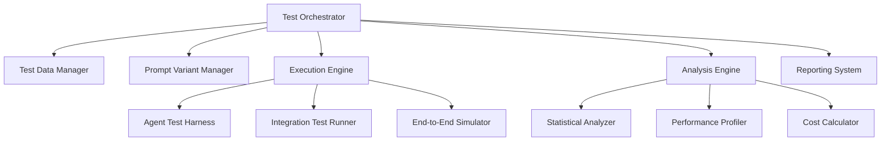

# Automated Testing Framework for Prompt Evolution System

**Version:** 1.0  
**Date:** June 2025  
**Status:** Draft

## Executive Summary

This document outlines the automated testing framework for the AI Interview Coach prompt evolution system. It transforms the manual testing approach defined in Phase 5 into a fully automated, CI/CD-integrated system that supports continuous prompt improvement and A/B testing.

## Architecture Overview

### Core Components



## Test Data Management

### 1. Golden Set Repository

```typescript
interface GoldenSetRepository {
  // Test data categories
  mockInterviews: {
    low: MockInterview[];     // 10 interviews
    medium: MockInterview[];  // 10 interviews
    high: MockInterview[];    // 10 interviews
  };
  
  userStories: {
    wellFormed: UserStory[];      // 15 stories
    incomplete: UserStory[];      // 10 stories
  };
  
  resumes: {
    annotated: AnnotatedResume[]; // 20 resumes
  };
  
  // Versioning and validation
  version: string;
  lastUpdated: Date;
  validateIntegrity(): Promise<boolean>;
}

interface MockInterview {
  id: string;
  transcript: string;
  complexity: 'LOW' | 'MEDIUM' | 'HIGH';
  
  expectedOutputs: {
    evaluatorScores: RubricScores;
    synthesisHighlights: string[];
    coachingRecommendations: string[];
  };
  
  metadata: {
    industry: string;
    role: string;
    experienceLevel: string;
    createdBy: string;
    consensusRating: number;
  };
}
```

### 2. Test Data Generation

```typescript
class TestDataGenerator {
  // Generates synthetic test cases for edge cases
  async generateEdgeCases(): Promise<EdgeCaseTestSet> {
    return {
      // Boundary conditions
      veryShortResponses: this.generateShortResponses(5),
      veryLongResponses: this.generateLongResponses(5),
      
      // Problematic content
      ambiguousResponses: this.generateAmbiguous(5),
      technicalJargonHeavy: this.generateTechnical(5),
      
      // Attack vectors
      promptInjectionAttempts: this.generateInjections(10),
      jailbreakAttempts: this.generateJailbreaks(10),
      
      // Performance stress
      complexNestedStructures: this.generateComplex(5),
      highTokenUsage: this.generateTokenIntensive(5)
    };
  }
  
  // Uses Challenger Agent to create adversarial tests
  async generateAdversarialCases(
    targetAgent: AgentType,
    count: number
  ): Promise<AdversarialTest[]> {
    const challengerPrompt = `
      Generate ${count} challenging test cases for the ${targetAgent}.
      Focus on: edge cases, ambiguity, complexity overload, and failure modes.
    `;
    
    return await this.challengerAgent.generate(challengerPrompt);
  }
}
```

## Prompt Variant Management

### 1. Prompt Registry

```typescript
interface PromptRegistry {
  // Stores all prompt variants with metadata
  prompts: Map<string, PromptVariant>;
  
  // Tracks lineage and evolution
  genealogy: PromptGenealogyTree;
  
  // A/B test configurations
  experiments: ActiveExperiment[];
}

interface PromptVariant {
  id: string;
  agentType: AgentType;
  
  content: {
    systemPrompt: string;
    userPromptTemplate: string;
    examples?: Example[];
  };
  
  metadata: {
    version: string;
    parentId?: string;
    createdAt: Date;
    createdBy: 'HUMAN' | 'MUTATOR_AGENT';
    
    strategy: 'LEAN' | 'COT' | 'STEP_BACK' | 'HYBRID';
    targetComplexity: 'LOW' | 'MEDIUM' | 'HIGH' | 'ALL';
    
    // Performance characteristics
    averageTokens: number;
    averageLatency: number;
    successRate: number;
  };
  
  // Feature flags for gradual rollout
  rollout: {
    percentage: number;
    targetSegments?: string[];
    excludeSegments?: string[];
  };
}
```

### 2. Mutation Engine

```typescript
class PromptMutationEngine {
  // Strategies for generating new variants
  private strategies = {
    simplification: (prompt: PromptVariant) => {
      // Remove chain-of-thought elements
      // Reduce example count
      // Simplify instructions
    },
    
    enhancement: (prompt: PromptVariant) => {
      // Add reasoning steps
      // Include more examples
      // Add clarifying instructions
    },
    
    hybridization: (promptA: PromptVariant, promptB: PromptVariant) => {
      // Combine best elements from both
      // Cross-pollinate strategies
    },
    
    specialization: (prompt: PromptVariant, focus: string) => {
      // Optimize for specific use case
      // Add domain-specific instructions
    }
  };
  
  async generateVariants(
    basePrompt: PromptVariant,
    count: number
  ): Promise<PromptVariant[]> {
    const variants: PromptVariant[] = [];
    
    // Use multiple strategies
    for (const strategy of Object.values(this.strategies)) {
      variants.push(await strategy(basePrompt));
    }
    
    // Use Mutator Agent for creative variations
    const aiGeneratedVariants = await this.mutatorAgent.generate({
      basePrompt,
      count: count - variants.length,
      constraints: this.getConstraints(basePrompt.agentType)
    });
    
    return [...variants, ...aiGeneratedVariants];
  }
}
```

## Test Execution Framework

### 1. Unit Test Harness

```typescript
class AgentUnitTestHarness {
  async runUnitTests(
    agent: Agent,
    promptVariant: PromptVariant,
    testSet: UnitTestSet
  ): Promise<UnitTestResults> {
    const results: UnitTestResult[] = [];
    
    for (const test of testSet.tests) {
      const startTime = Date.now();
      
      try {
        // Execute with timeout
        const output = await this.executeWithTimeout(
          () => agent.process(test.input, promptVariant),
          test.timeout || 30000
        );
        
        // Validate output
        const validation = await this.validateOutput(
          output,
          test.expectedOutput,
          test.validationRules
        );
        
        results.push({
          testId: test.id,
          passed: validation.passed,
          
          performance: {
            latency: Date.now() - startTime,
            tokensUsed: output.tokensUsed,
            cost: this.calculateCost(output.tokensUsed)
          },
          
          accuracy: {
            score: validation.score,
            errors: validation.errors
          },
          
          output: output
        });
        
      } catch (error) {
        results.push({
          testId: test.id,
          passed: false,
          error: error.message,
          errorType: this.classifyError(error)
        });
      }
    }
    
    return this.aggregateResults(results);
  }
  
  private validateOutput(
    actual: any,
    expected: any,
    rules: ValidationRule[]
  ): ValidationResult {
    const validators = {
      exactMatch: (a, e) => JSON.stringify(a) === JSON.stringify(e),
      fuzzyMatch: (a, e) => this.calculateSimilarity(a, e) > 0.85,
      schemaMatch: (a, e) => this.validateSchema(a, e),
      customRule: (a, e, rule) => rule.validate(a, e)
    };
    
    // Apply all validation rules
    const results = rules.map(rule => 
      validators[rule.type](actual, expected, rule)
    );
    
    return {
      passed: results.every(r => r),
      score: results.filter(r => r).length / results.length,
      errors: this.collectErrors(results, rules)
    };
  }
}
```

### 2. Integration Test Runner

```typescript
class IntegrationTestRunner {
  async runPipelineTests(
    pipeline: AgentPipeline,
    testScenarios: IntegrationScenario[]
  ): Promise<IntegrationTestResults> {
    const results: IntegrationTestResult[] = [];
    
    for (const scenario of testScenarios) {
      // Set up test environment
      const testEnv = await this.setupTestEnvironment(scenario);
      
      try {
        // Execute pipeline with tracing
        const trace = await this.executeWithTracing(
          () => pipeline.execute(scenario.input),
          testEnv
        );
        
        // Validate end-to-end output
        const validation = await this.validateScenario(
          trace.finalOutput,
          scenario.expectedOutput
        );
        
        // Check intermediate states
        const stateValidation = await this.validateIntermediateStates(
          trace.intermediateStates,
          scenario.expectedStates
        );
        
        results.push({
          scenarioId: scenario.id,
          passed: validation.passed && stateValidation.passed,
          
          trace: {
            duration: trace.duration,
            agentSequence: trace.agentCalls,
            stateTransitions: trace.stateChanges
          },
          
          performance: {
            totalLatency: trace.duration,
            agentLatencies: trace.agentLatencies,
            totalTokens: trace.totalTokens,
            totalCost: trace.totalCost
          },
          
          validation: {
            outputScore: validation.score,
            stateScore: stateValidation.score,
            errors: [...validation.errors, ...stateValidation.errors]
          }
        });
        
      } finally {
        await this.teardownTestEnvironment(testEnv);
      }
    }
    
    return this.aggregateIntegrationResults(results);
  }
}
```

### 3. End-to-End Test Simulator

```typescript
class E2ETestSimulator {
  async simulateUserSession(
    scenario: E2EScenario,
    systemConfig: SystemConfig
  ): Promise<E2ETestResult> {
    // Create virtual user
    const virtualUser = await this.createVirtualUser(scenario.userProfile);
    
    // Initialize session
    const session = await this.initializeSession(virtualUser, systemConfig);
    
    // Execute scenario steps
    const stepResults: StepResult[] = [];
    
    for (const step of scenario.steps) {
      const result = await this.executeStep(session, step);
      stepResults.push(result);
      
      // Check for early termination conditions
      if (result.shouldTerminate) {
        break;
      }
      
      // Simulate user thinking time
      await this.simulateDelay(step.userDelay || 1000);
    }
    
    // Evaluate session success
    return {
      scenarioId: scenario.id,
      completed: stepResults.every(r => r.success),
      
      userExperience: {
        totalDuration: this.calculateTotalDuration(stepResults),
        interactionCount: stepResults.length,
        satisfactionScore: this.calculateSatisfaction(stepResults)
      },
      
      systemPerformance: {
        averageResponseTime: this.calculateAvgResponseTime(stepResults),
        errorRate: this.calculateErrorRate(stepResults),
        fallbackUsage: this.countFallbacks(stepResults)
      },
      
      businessMetrics: {
        goalAchieved: this.checkGoalAchievement(scenario, stepResults),
        valueDelivered: this.calculateValue(scenario, stepResults)
      }
    };
  }
}
```

## Analysis and Reporting

### 1. Statistical Analysis Engine

```typescript
class PromptPerformanceAnalyzer {
  async analyzeVariantPerformance(
    variantId: string,
    testResults: TestResults[]
  ): Promise<PerformanceAnalysis> {
    return {
      // Accuracy metrics
      accuracy: {
        mean: this.calculateMean(testResults.map(r => r.accuracy)),
        median: this.calculateMedian(testResults.map(r => r.accuracy)),
        stdDev: this.calculateStdDev(testResults.map(r => r.accuracy)),
        confidenceInterval: this.calculate95CI(testResults.map(r => r.accuracy))
      },
      
      // Performance metrics
      latency: {
        p50: this.calculatePercentile(testResults.map(r => r.latency), 50),
        p95: this.calculatePercentile(testResults.map(r => r.latency), 95),
        p99: this.calculatePercentile(testResults.map(r => r.latency), 99)
      },
      
      // Cost efficiency
      costEfficiency: {
        tokensPerSuccessfulTest: this.calculateTokenEfficiency(testResults),
        costPerPoint: this.calculateCostPerAccuracyPoint(testResults),
        ROI: this.calculateROI(testResults)
      },
      
      // Complexity handling
      complexityPerformance: {
        low: this.filterAndAnalyze(testResults, 'LOW'),
        medium: this.filterAndAnalyze(testResults, 'MEDIUM'),
        high: this.filterAndAnalyze(testResults, 'HIGH')
      },
      
      // Failure analysis
      failurePatterns: {
        commonErrors: this.identifyErrorPatterns(testResults),
        failureRate: this.calculateFailureRate(testResults),
        recoverySuccess: this.calculateRecoveryRate(testResults)
      }
    };
  }
  
  async compareVariants(
    baselineId: string,
    candidateId: string,
    testResults: Map<string, TestResults[]>
  ): Promise<VariantComparison> {
    const baseline = testResults.get(baselineId);
    const candidate = testResults.get(candidateId);
    
    return {
      // Statistical significance testing
      accuracy: {
        improvement: this.calculateImprovement(baseline, candidate, 'accuracy'),
        pValue: this.calculatePValue(baseline, candidate, 'accuracy'),
        significant: this.isStatisticallySignificant(baseline, candidate, 'accuracy')
      },
      
      // Performance comparison
      latency: {
        improvement: this.calculateImprovement(baseline, candidate, 'latency'),
        acceptable: this.meetsLatencyThreshold(candidate)
      },
      
      // Cost comparison
      cost: {
        increase: this.calculateCostIncrease(baseline, candidate),
        worthIt: this.calculateValueForMoney(baseline, candidate)
      },
      
      // Recommendation
      recommendation: this.generateRecommendation(baseline, candidate)
    };
  }
}
```

### 2. Test Report Generator

```typescript
class TestReportGenerator {
  async generateComprehensiveReport(
    testRun: TestRun
  ): Promise<TestReport> {
    return {
      metadata: {
        runId: testRun.id,
        timestamp: testRun.timestamp,
        duration: testRun.duration,
        environment: testRun.environment
      },
      
      summary: {
        totalTests: testRun.totalTests,
        passed: testRun.passedTests,
        failed: testRun.failedTests,
        passRate: testRun.passedTests / testRun.totalTests,
        
        promptVariantsTested: testRun.variantCount,
        bestPerforming: testRun.bestVariant,
        worstPerforming: testRun.worstVariant
      },
      
      detailedResults: {
        byAgent: this.aggregateByAgent(testRun),
        byComplexity: this.aggregateByComplexity(testRun),
        byTestType: this.aggregateByTestType(testRun)
      },
      
      recommendations: {
        promotions: this.identifyVariantsToPromote(testRun),
        demotions: this.identifyVariantsToDemote(testRun),
        investigations: this.identifyAreasForInvestigation(testRun)
      },
      
      visualizations: {
        performanceCharts: this.generatePerformanceCharts(testRun),
        costAnalysis: this.generateCostCharts(testRun),
        errorHeatmap: this.generateErrorHeatmap(testRun)
      }
    };
  }
}
```

## CI/CD Integration

### 1. GitHub Actions Workflow

```yaml
name: Prompt Testing Pipeline

on:
  pull_request:
    paths:
      - 'prompts/**'
      - 'tests/**'
  schedule:
    - cron: '0 */6 * * *'  # Every 6 hours

jobs:
  unit-tests:
    runs-on: ubuntu-latest
    steps:
      - uses: actions/checkout@v3
      
      - name: Setup Test Environment
        run: |
          npm install
          npm run setup:test-data
      
      - name: Run Unit Tests
        run: |
          npm run test:agents -- --coverage
        env:
          GEMINI_API_KEY: ${{ secrets.GEMINI_API_KEY }}
      
      - name: Upload Coverage
        uses: codecov/codecov-action@v3
  
  integration-tests:
    runs-on: ubuntu-latest
    needs: unit-tests
    steps:
      - name: Run Integration Tests
        run: |
          npm run test:integration
      
      - name: Performance Regression Check
        run: |
          npm run test:performance
          npm run check:regression
  
  prompt-evolution:
    runs-on: ubuntu-latest
    if: github.event_name == 'schedule'
    steps:
      - name: Generate New Variants
        run: |
          npm run prompts:generate-variants
      
      - name: Test New Variants
        run: |
          npm run test:variants
      
      - name: Analyze Results
        run: |
          npm run analyze:variant-performance
      
      - name: Create PR if Improvements Found
        run: |
          npm run prompts:create-improvement-pr
```

### 2. Deployment Gates

```typescript
class DeploymentGatekeeper {
  async evaluateReadiness(
    candidateVersion: string,
    testResults: TestResults
  ): Promise<DeploymentDecision> {
    const checks = {
      // Quality gates
      accuracyThreshold: testResults.accuracy.mean >= 0.85,
      latencyThreshold: testResults.latency.p95 <= 5000,
      errorRateThreshold: testResults.errorRate <= 0.02,
      
      // Regression checks
      noAccuracyRegression: !this.hasRegression(testResults, 'accuracy'),
      noLatencyRegression: !this.hasRegression(testResults, 'latency'),
      
      // Cost checks
      costIncrease: testResults.costIncrease <= 0.10,
      
      // Coverage checks
      testCoverage: testResults.coverage >= 0.80,
      edgeCasesCovered: testResults.edgeCasePassRate >= 0.90
    };
    
    const allChecksPassed = Object.values(checks).every(v => v);
    
    return {
      approved: allChecksPassed,
      checks: checks,
      recommendation: allChecksPassed ? 'DEPLOY' : 'INVESTIGATE',
      blockers: this.identifyBlockers(checks)
    };
  }
}
```

## Success Metrics

- **Test Coverage**: >90% of agent code paths tested
- **Test Execution Time**: <30 minutes for full test suite
- **Variant Generation**: 5+ new variants tested daily
- **Improvement Rate**: >10% monthly accuracy improvement
- **False Positive Rate**: <5% in variant recommendations
- **Cost Efficiency**: <$100/day for continuous testing