# Darwin-Gödel Machine Prompt Optimization (DGM-PO) Architecture

This document details the architecture of the Darwin-Gödel Machine-inspired Prompt Optimization system, which automatically evolves and improves prompts through empirical validation and meta-learning.

## System Overview

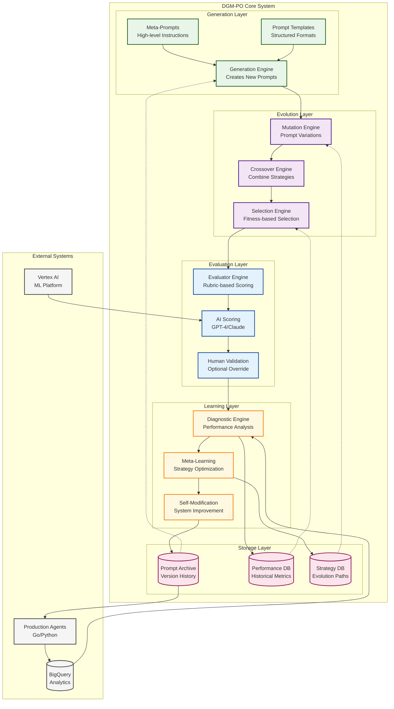

## Component Details

### 1. Generation Layer

#### Meta-Prompts System
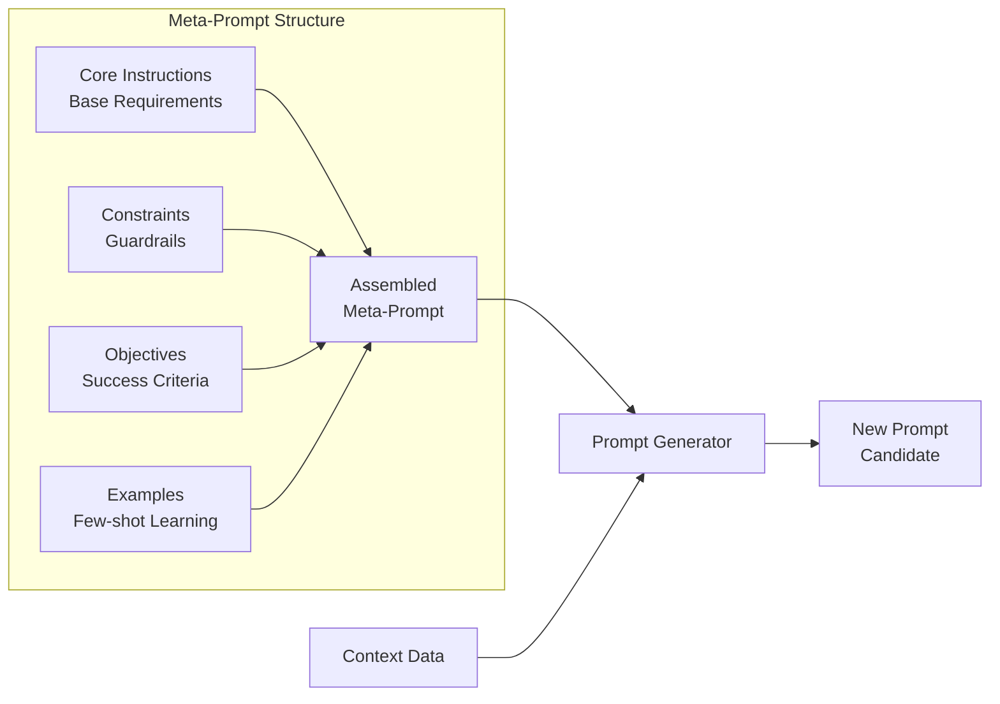

#### Template Management
```yaml
# Example Template Structure
template:
  id: "behavioral_star_v2"
  category: "behavioral_interview"
  components:
    - instruction: "Ask about {situation_type} using STAR format"
    - context: "Role: {job_role}, Level: {seniority_level}"
    - constraints: 
        - "Focus on {competency}"
        - "Appropriate for {company_culture}"
    - evaluation_criteria:
        - "Clear situation setup"
        - "Specific actions required"
        - "Measurable results expected"
```

### 2. Evolution Layer

#### Mutation Strategies
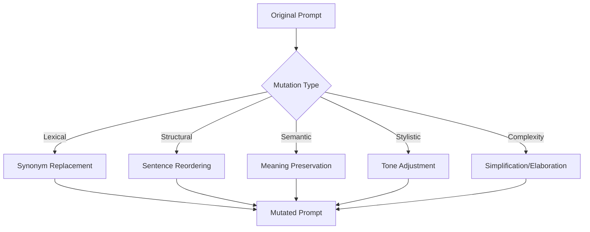

#### Genetic Algorithm Flow
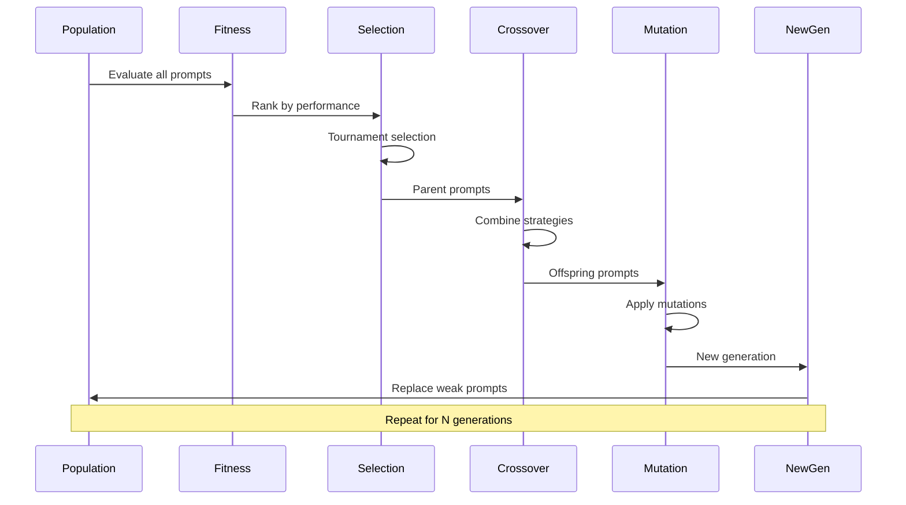

### 3. Evaluation Layer

#### Rubric-Based Scoring System
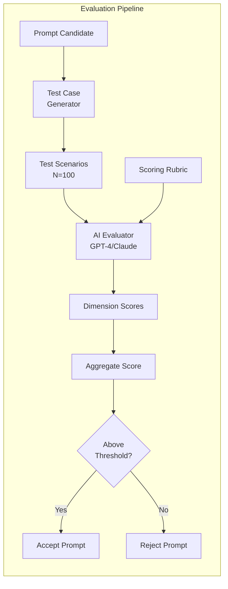

#### Scoring Dimensions
| Dimension | Weight | Description |
|-----------|--------|-------------|
| Clarity | 25% | How clear and unambiguous is the prompt? |
| Relevance | 20% | Does it elicit relevant information? |
| Depth | 20% | Does it encourage detailed responses? |
| Fairness | 15% | Is it unbiased and inclusive? |
| Difficulty | 10% | Appropriate for the target level? |
| Engagement | 10% | Does it maintain candidate interest? |

### 4. Learning Layer

#### Diagnostic Analysis Pipeline
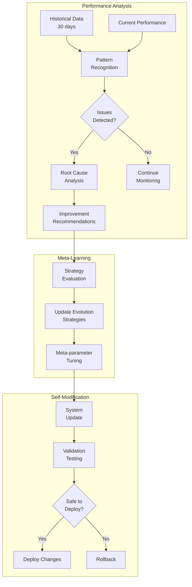

### 5. Storage Layer

#### Archive Repository Schema
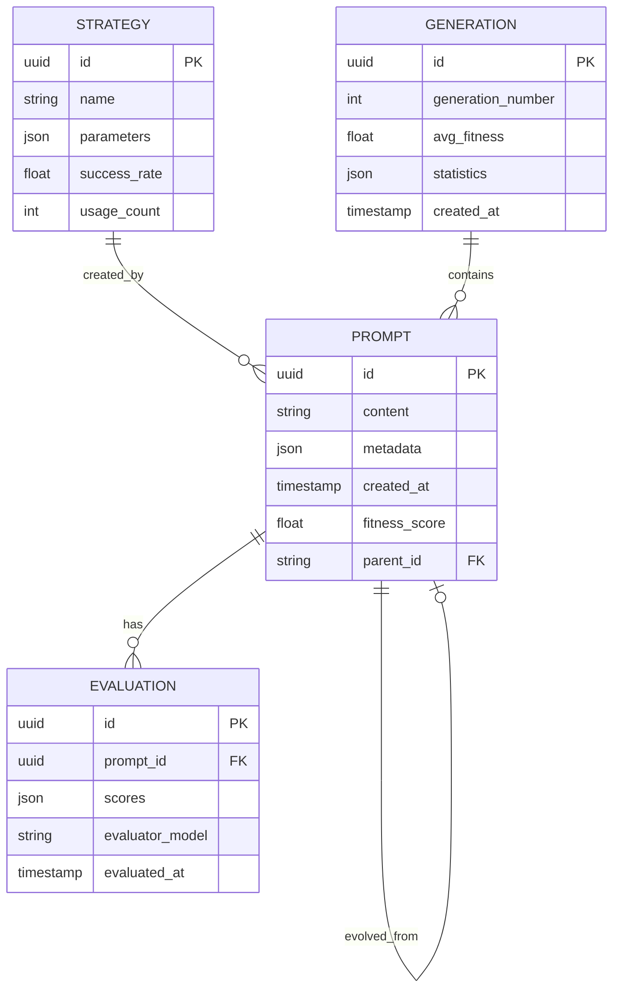

## Operational Workflows

### Daily Optimization Cycle
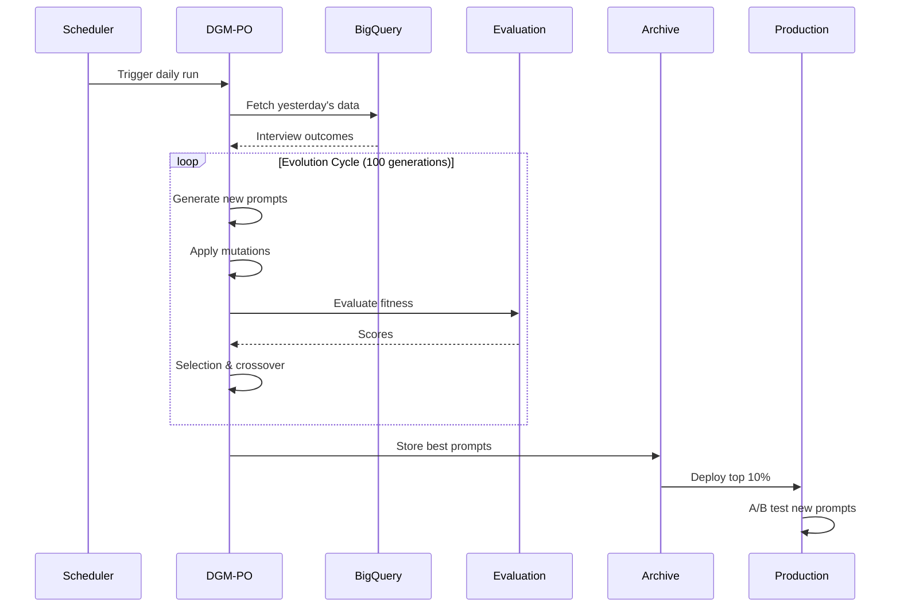

### Continuous Improvement Loop
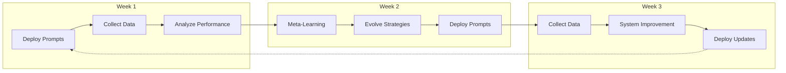

## Integration Points

### API Endpoints
```yaml
# Prompt Retrieval API
GET /api/prompts/optimized/{category}
Response:
  - prompt_id: uuid
  - content: string
  - confidence_score: float
  - metadata: object

# Performance Feedback API  
POST /api/prompts/feedback
Body:
  - prompt_id: uuid
  - session_id: uuid
  - outcome_metrics: object
  - user_feedback: string

# Manual Override API
POST /api/prompts/override
Body:
  - prompt_id: uuid
  - updated_content: string
  - reason: string
  - author: string
```

### Monitoring Dashboard
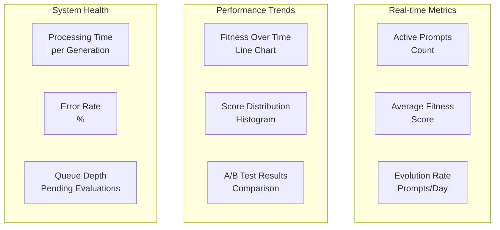

## Security & Governance

### Prompt Safety Measures
1. **Content Filtering**: All generated prompts pass through safety filters
2. **Bias Detection**: Automated bias detection using fairness metrics
3. **Human Review**: High-stakes prompts require human approval
4. **Audit Trail**: Complete history of all prompt evolution

### Access Control
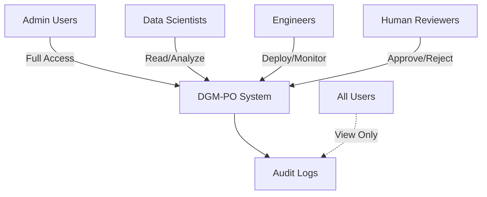

## Performance Benchmarks

### System Performance Targets
| Metric | Target | Current |
|--------|--------|---------|
| Generation Time | <5 min/cycle | - |
| Evaluation Throughput | 1000 prompts/hour | - |
| Storage Efficiency | <1MB/1000 prompts | - |
| API Latency (p99) | <100ms | - |
| Fitness Improvement | 5%/month | - |

### ML Model Efficiency
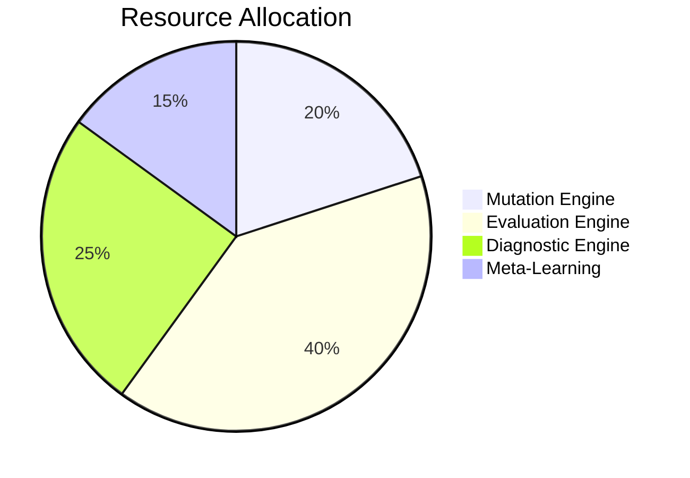

## Future Enhancements

### Planned Features
1. **Multi-objective Optimization**: Balance multiple competing objectives
2. **Transfer Learning**: Apply successful strategies across categories
3. **Adversarial Testing**: Generate adversarial examples for robustness
4. **Federated Learning**: Learn from multiple deployment environments
5. **Explainable AI**: Provide explanations for prompt improvements

### Research Directions
- Neural Architecture Search for prompt structures
- Reinforcement Learning for online optimization
- Causal inference for prompt effectiveness
- Multi-modal prompts (text + visual cues)

This architecture provides a robust, self-improving system for prompt optimization that continuously learns and adapts to improve interview quality.