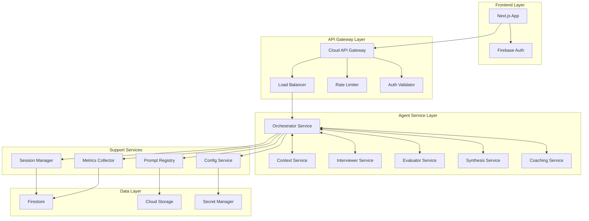

# Firebase/GCP Integration Architecture for Multi-Agent System

**Version:** 1.0  
**Date:** June 2025  
**Status:** Draft

## Executive Summary

This document defines the integration architecture between the AI Interview Coach multi-agent system and Google Cloud Platform services, including Firebase Authentication, Cloud Functions, Secret Manager, and monitoring services. It ensures secure, scalable, and cost-effective operations.

## Current Integration State

### Existing Components
- **Frontend**: Next.js with Firebase Auth context
- **Backend**: Go Cloud Functions with Firebase Admin SDK
- **Authentication**: Firebase Auth with JWT token validation
- **Secrets**: Google Cloud Secret Manager
- **Infrastructure**: Pulumi-managed GCP resources

### Current Limitations
- No service mesh for agent communication
- Manual configuration management
- Limited observability between services
- No centralized rate limiting
- Basic error propagation

## Target Architecture

### 1. Service Mesh Design



### 2. Authentication and Authorization Flow

```typescript
interface AuthenticationFlow {
  // Frontend authentication
  clientAuth: {
    provider: 'Firebase Auth';
    tokenFormat: 'JWT';
    refreshStrategy: 'Automatic';
    storage: 'Secure HTTP-only cookies';
  };
  
  // Service-to-service authentication
  serviceAuth: {
    mechanism: 'Google Service Account';
    tokenExchange: 'Google Token Exchange API';
    scope: 'Minimal required permissions';
  };
  
  // Authorization matrix
  permissions: {
    [Role]: {
      agents: AgentName[];
      operations: Operation[];
      resources: Resource[];
    };
  };
}

// Role-based access control
enum Role {
  USER = 'user',
  PREMIUM_USER = 'premium_user',
  ADMIN = 'admin',
  SYSTEM = 'system'
}

const authorizationMatrix = {
  [Role.USER]: {
    agents: ['Orchestrator', 'Context', 'Interviewer', 'Evaluator', 'Synthesis'],
    operations: ['read', 'create_session', 'submit_response'],
    resources: ['own_sessions', 'public_prompts']
  },
  
  [Role.PREMIUM_USER]: {
    agents: ['*'], // All agents
    operations: ['read', 'create_session', 'submit_response', 'export_data'],
    resources: ['own_sessions', 'premium_prompts', 'advanced_features']
  },
  
  [Role.SYSTEM]: {
    agents: ['*'],
    operations: ['*'],
    resources: ['*']
  }
};
```

### 3. Service Discovery and Registration

```typescript
interface ServiceRegistry {
  // Agent service endpoints
  agents: Map<AgentName, ServiceEndpoint>;
  
  // Health checking
  healthChecks: Map<ServiceName, HealthCheck>;
  
  // Load balancing
  loadBalancing: {
    strategy: 'ROUND_ROBIN' | 'LEAST_CONNECTIONS' | 'WEIGHTED';
    weights: Map<ServiceName, number>;
  };
}

interface ServiceEndpoint {
  name: string;
  url: string;
  version: string;
  
  // Capabilities
  supportedOperations: string[];
  supportedComplexity: ComplexityLevel[];
  
  // SLA requirements
  sla: {
    maxLatency: number;
    availability: number;
    maxConcurrency: number;
  };
  
  // Circuit breaker config
  circuitBreaker: {
    enabled: boolean;
    failureThreshold: number;
    resetTimeout: number;
  };
}

class ServiceDiscovery {
  async registerService(endpoint: ServiceEndpoint): Promise<void> {
    // Register with Cloud Service Directory
    await this.cloudServiceDirectory.register(endpoint);
    
    // Set up health checks
    await this.setupHealthCheck(endpoint);
    
    // Configure load balancing
    await this.configureLoadBalancer(endpoint);
  }
  
  async discoverAgent(agentName: AgentName): Promise<ServiceEndpoint> {
    // Get healthy instances
    const instances = await this.cloudServiceDirectory
      .getHealthyInstances(agentName);
    
    // Apply load balancing
    return this.loadBalancer.selectInstance(instances);
  }
}
```

## Configuration Management

### 1. Centralized Configuration Service

```typescript
interface ConfigurationService {
  // Agent configurations
  agentConfigs: Map<AgentName, AgentConfig>;
  
  // Environment-specific settings
  environmentConfigs: Map<Environment, EnvironmentConfig>;
  
  // Feature flags
  featureFlags: Map<string, FeatureFlag>;
  
  // Prompt configurations
  promptConfigs: Map<string, PromptConfig>;
}

interface AgentConfig {
  name: AgentName;
  version: string;
  
  // Runtime configuration
  runtime: {
    timeout: number;
    retries: number;
    maxConcurrency: number;
    memoryLimit: string;
  };
  
  // Model configuration
  model: {
    provider: 'Google' | 'OpenAI' | 'Anthropic';
    modelName: string;
    temperature: number;
    maxTokens: number;
    topP?: number;
  };
  
  // Prompt configuration
  prompts: {
    defaultVariant: string;
    fallbackVariant: string;
    abTestConfig?: {
      enabled: boolean;
      variants: string[];
      trafficSplit: number[];
    };
  };
  
  // Monitoring configuration
  monitoring: {
    metricsEnabled: boolean;
    tracingEnabled: boolean;
    logLevel: 'DEBUG' | 'INFO' | 'WARN' | 'ERROR';
  };
}

class ConfigManager {
  constructor(
    private secretManager: SecretManagerClient,
    private firestore: FirestoreClient
  ) {}
  
  async getAgentConfig(
    agentName: AgentName,
    environment: Environment
  ): Promise<AgentConfig> {
    // Load base configuration
    const baseConfig = await this.loadBaseConfig(agentName);
    
    // Apply environment-specific overrides
    const envOverrides = await this.loadEnvironmentConfig(environment);
    
    // Apply feature flag overrides
    const flagOverrides = await this.evaluateFeatureFlags(agentName);
    
    // Merge configurations with precedence
    return this.mergeConfigs(baseConfig, envOverrides, flagOverrides);
  }
  
  async updateConfig(
    agentName: AgentName,
    updates: Partial<AgentConfig>
  ): Promise<void> {
    // Validate configuration
    await this.validateConfig(updates);
    
    // Apply gradual rollout
    await this.gradualRollout(agentName, updates);
    
    // Notify affected services
    await this.notifyConfigChange(agentName, updates);
  }
}
```

### 2. Feature Flag System

```typescript
interface FeatureFlag {
  name: string;
  description: string;
  
  // Targeting
  enabled: boolean;
  targeting: {
    percentage: number;
    userSegments?: string[];
    environmentFilter?: Environment[];
  };
  
  // Variants for A/B testing
  variants?: {
    [variantName: string]: any;
  };
  
  // Metadata
  createdAt: Date;
  createdBy: string;
  expiresAt?: Date;
}

class FeatureFlagManager {
  async evaluateFlag(
    flagName: string,
    context: EvaluationContext
  ): Promise<FeatureFlagResult> {
    const flag = await this.getFlag(flagName);
    
    // Check if flag is enabled
    if (!flag.enabled) {
      return { enabled: false, variant: 'control' };
    }
    
    // Check environment filter
    if (flag.targeting.environmentFilter && 
        !flag.targeting.environmentFilter.includes(context.environment)) {
      return { enabled: false, variant: 'control' };
    }
    
    // Check user segment targeting
    if (!this.matchesSegment(context.user, flag.targeting.userSegments)) {
      return { enabled: false, variant: 'control' };
    }
    
    // Check percentage rollout
    if (!this.inPercentage(context.user.id, flag.targeting.percentage)) {
      return { enabled: false, variant: 'control' };
    }
    
    // Determine variant
    const variant = this.selectVariant(context.user.id, flag.variants);
    
    return { enabled: true, variant: variant };
  }
}
```

## Security Architecture

### 1. Network Security

```typescript
interface NetworkSecurity {
  // VPC configuration
  vpc: {
    privateServiceConnect: boolean;
    authorizedNetworks: string[];
    firewallRules: FirewallRule[];
  };
  
  // TLS configuration
  tls: {
    minVersion: '1.2';
    certificateProvider: 'Google Managed Certificate';
    mtlsEnabled: boolean; // For service-to-service
  };
  
  // API security
  apiSecurity: {
    rateLimiting: RateLimitConfig;
    authenticationRequired: boolean;
    corsPolicy: CorsPolicy;
  };
}

interface RateLimitConfig {
  // Per-user limits
  userLimits: {
    requestsPerMinute: number;
    requestsPerHour: number;
    concurrentSessions: number;
  };
  
  // Per-service limits
  serviceLimits: {
    [agentName: string]: {
      requestsPerSecond: number;
      burstLimit: number;
    };
  };
  
  // Quota enforcement
  quotaEnforcement: {
    tokensPerDay: Map<UserTier, number>;
    costPerDay: Map<UserTier, number>;
  };
}
```

### 2. Data Security and Privacy

```typescript
interface DataSecurity {
  // Encryption at rest
  encryption: {
    provider: 'Google Cloud KMS';
    keyRotationPeriod: '90 days';
    customerManagedKeys: boolean;
  };
  
  // Data classification
  dataClassification: {
    [dataType: string]: {
      classification: 'PUBLIC' | 'INTERNAL' | 'CONFIDENTIAL' | 'RESTRICTED';
      retentionPeriod: string;
      allowedRegions: string[];
    };
  };
  
  // PII handling
  piiHandling: {
    detection: 'Google DLP API';
    sanitization: 'Automatic redaction';
    auditLogging: boolean;
  };
}

const dataClassificationRules = {
  'user_resume': {
    classification: 'CONFIDENTIAL',
    retentionPeriod: '2 years',
    allowedRegions: ['us-central1', 'europe-west1']
  },
  
  'interview_transcript': {
    classification: 'CONFIDENTIAL',
    retentionPeriod: '1 year',
    allowedRegions: ['us-central1', 'europe-west1']
  },
  
  'agent_prompts': {
    classification: 'INTERNAL',
    retentionPeriod: 'indefinite',
    allowedRegions: ['global']
  },
  
  'system_logs': {
    classification: 'INTERNAL',
    retentionPeriod: '90 days',
    allowedRegions: ['us-central1']
  }
};
```

## Scalability and Performance

### 1. Auto-scaling Configuration

```typescript
interface ScalingConfig {
  // Function-level scaling
  functions: {
    [agentName: string]: {
      minInstances: number;
      maxInstances: number;
      concurrencyLimit: number;
      
      // Scaling triggers
      cpuThreshold: number;
      memoryThreshold: number;
      requestLatency: number;
    };
  };
  
  // Database scaling
  database: {
    firestoreAutoscaling: boolean;
    maxConcurrentConnections: number;
    
    // Read replicas for heavy read workloads
    readReplicas: {
      enabled: boolean;
      regions: string[];
    };
  };
  
  // Caching strategy
  caching: {
    layers: CacheLayer[];
    policies: CachePolicy[];
  };
}

interface CacheLayer {
  name: string;
  type: 'MEMORY' | 'REDIS' | 'CDN';
  ttl: number;
  
  // What to cache
  cacheableOperations: string[];
  cacheKeyStrategy: 'USER_BASED' | 'CONTENT_BASED' | 'HYBRID';
}

const cachingStrategy = {
  promptCache: {
    type: 'REDIS',
    ttl: 3600, // 1 hour
    cacheableOperations: ['prompt_generation', 'template_rendering'],
    keyStrategy: 'CONTENT_BASED'
  },
  
  userSessionCache: {
    type: 'MEMORY',
    ttl: 1800, // 30 minutes
    cacheableOperations: ['session_state', 'user_context'],
    keyStrategy: 'USER_BASED'
  },
  
  staticContentCache: {
    type: 'CDN',
    ttl: 86400, // 24 hours
    cacheableOperations: ['assessment_data', 'question_banks'],
    keyStrategy: 'CONTENT_BASED'
  }
};
```

### 2. Performance Optimization

```typescript
interface PerformanceOptimization {
  // Request optimization
  requestOptimization: {
    // Connection pooling
    connectionPooling: {
      maxConnections: number;
      idleTimeout: number;
      keepAlive: boolean;
    };
    
    // Request batching
    batching: {
      enabled: boolean;
      maxBatchSize: number;
      batchWindow: number;
    };
    
    // Compression
    compression: {
      enabled: boolean;
      algorithm: 'gzip' | 'brotli';
      level: number;
    };
  };
  
  // Agent optimization
  agentOptimization: {
    // Prompt caching
    promptCaching: boolean;
    
    // Model warming
    modelWarming: {
      enabled: boolean;
      instances: number;
      schedule: string; // Cron expression
    };
    
    // Response streaming
    streaming: {
      enabled: boolean;
      chunkSize: number;
    };
  };
}
```

## Monitoring and Observability Integration

### 1. Metrics Integration

```typescript
interface MetricsIntegration {
  // Google Cloud Monitoring
  cloudMonitoring: {
    customMetrics: CustomMetric[];
    dashboards: Dashboard[];
    alertPolicies: AlertPolicy[];
  };
  
  // OpenTelemetry integration
  openTelemetry: {
    tracingEnabled: boolean;
    metricsEnabled: boolean;
    logsEnabled: boolean;
    
    // Sampling configuration
    sampling: {
      strategy: 'PROBABILISTIC' | 'RATE_LIMITED';
      rate: number;
    };
  };
  
  // Business metrics
  businessMetrics: {
    userSatisfaction: MetricDefinition;
    costPerSession: MetricDefinition;
    conversionRate: MetricDefinition;
  };
}

interface CustomMetric {
  name: string;
  type: 'GAUGE' | 'COUNTER' | 'HISTOGRAM';
  unit: string;
  description: string;
  
  // Labels for dimensions
  labels: string[];
  
  // Alerting thresholds
  alerting?: {
    warning: number;
    critical: number;
  };
}
```

### 2. Logging Strategy

```typescript
interface LoggingStrategy {
  // Structured logging
  structure: {
    format: 'JSON';
    requiredFields: string[];
    optionalFields: string[];
  };
  
  // Log levels by component
  levels: {
    [componentName: string]: 'DEBUG' | 'INFO' | 'WARN' | 'ERROR';
  };
  
  // Log aggregation
  aggregation: {
    // Google Cloud Logging
    cloudLogging: {
      enabled: boolean;
      retentionDays: number;
      exportToStorage: boolean;
    };
    
    // Log-based metrics
    logBasedMetrics: LogMetric[];
  };
  
  // Audit logging
  auditLogging: {
    enabled: boolean;
    events: AuditEvent[];
    retention: string;
  };
}
```

## Implementation Roadmap

### Phase 1: Security and Authentication (Week 1-2)
1. Implement service-to-service authentication
2. Set up role-based access control
3. Configure network security policies
4. Implement rate limiting

### Phase 2: Configuration Management (Week 3-4)
1. Deploy centralized configuration service
2. Implement feature flag system
3. Set up environment-specific configurations
4. Create configuration validation

### Phase 3: Service Mesh (Week 5-6)
1. Implement service discovery
2. Set up load balancing
3. Configure circuit breakers
4. Add health checks

### Phase 4: Performance and Scaling (Week 7-8)
1. Implement caching layers
2. Configure auto-scaling
3. Optimize database performance
4. Add performance monitoring

### Phase 5: Advanced Features (Week 9-10)
1. Implement A/B testing infrastructure
2. Add comprehensive monitoring
3. Set up automated alerts
4. Create operational runbooks

## Success Metrics

- **Security**: Zero security incidents
- **Reliability**: 99.9% service availability
- **Performance**: <2s response time for 95th percentile
- **Scalability**: Handle 10x traffic spikes without degradation
- **Operational**: <5 minutes MTTR for common issues